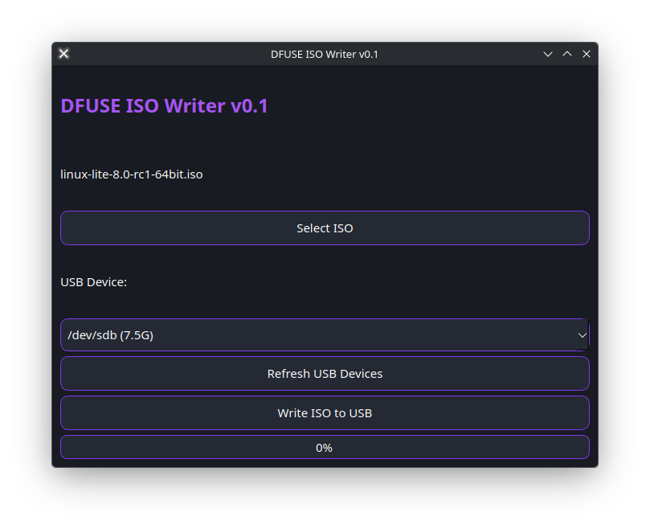
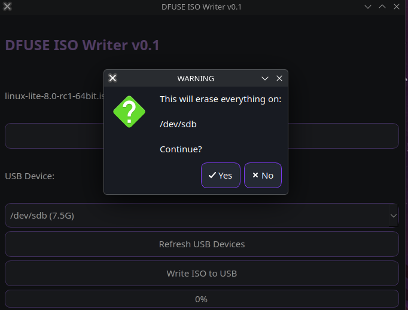
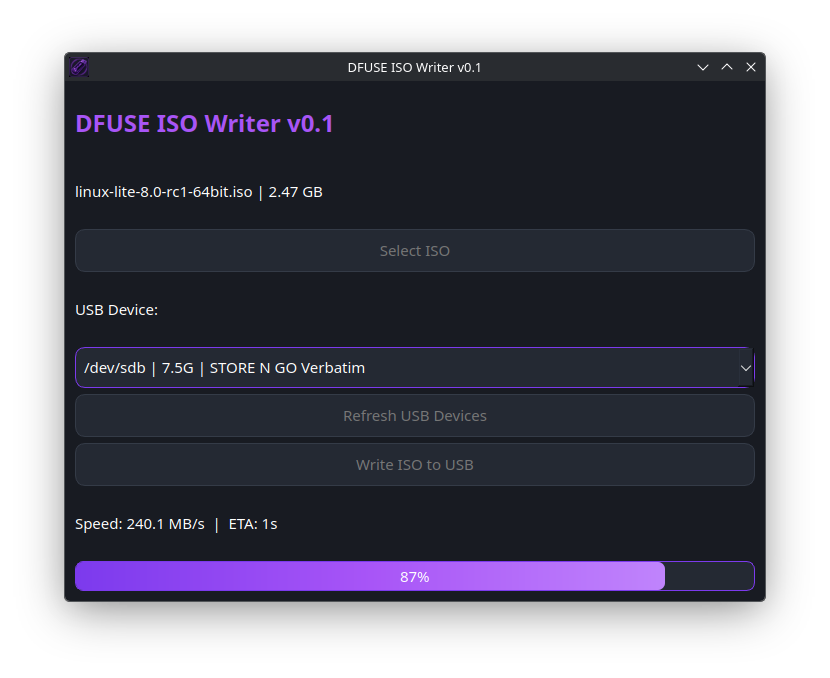
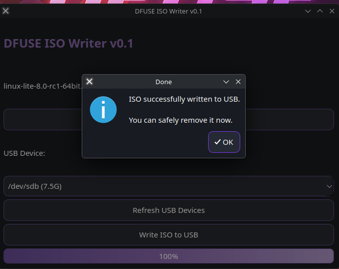

# DFUSE ISO Writer

A modern Linux ISO-to-USB writing utility built with Python, PySide6, and PolicyKit.

DFUSE ISO Writer makes it easy to create bootable USB drives from Linux ISO images using a simple and modern graphical interface.

---

## Features

* Automatic USB device detection
* Bootable USB creation
* Real-time progress tracking
* Write speed monitoring
* ETA calculation
* DFUSE Purple Neon Theme
* Modern PySide6 GUI
* Linux-first design
* PolicyKit integration for elevated privileges
* Lightweight and easy to use

---

## Install from DFUSE Repository

Add the repository to `/etc/pacman.conf`:

```ini
[dfuse-repo]
SigLevel = Optional TrustAll
Server = https://dfuse06.github.io/dfuse-repo
```

Sync repositories:

```bash
sudo pacman -Syy
```

Install DFUSE ISO Writer:

```bash
sudo pacman -S dfuse-iso-writer
```

Launch:

```bash
dfuse-iso-writer
```

---

# Screenshots

## Startup



## ISO Selected



## Writing Process



## Completed Write



---

## Requirements

### Arch Linux / EndeavourOS

```bash
sudo pacman -S python pyside6 polkit
```

### Ubuntu / Debian

```bash
sudo apt install python3 python3-pyside6 policykit-1
```

---

## Run from Source

Clone the repository:

```bash
git clone https://github.com/dfuse06/DFUSE-ISO-Writer.git
cd DFUSE-ISO-Writer
```

Create a virtual environment:

```bash
python -m venv venv
source venv/bin/activate
```

Install dependencies:

```bash
pip install PySide6 pyinstaller
```

Launch:

```bash
python main.py
```

---

## Usage

1. Insert a USB drive.
2. Select a Linux ISO image.
3. Select the target USB device.
4. Click **Write ISO to USB**.
5. Enter your administrator password when prompted.
6. Wait for the write process to complete.
7. Safely remove the USB drive and boot from it.

---

## Warning

⚠️ Writing an ISO image will completely erase all data on the selected USB device.

Always verify the target device before starting the write process.

---

## Building a Package

Build a standalone executable:

```bash
pyinstaller --onefile --windowed \
  --name dfuse-iso-writer \
  --add-data "themes:themes" \
  --add-data "dfuse_iso.png:." \
  main.py
```

Build an Arch package:

```bash
makepkg -f
```

---

## License

MIT License

Copyright (c) 2026 Dustin Winings

---

## Author

**Dustin Winings (dfuse)**

GitHub: https://github.com/dfuse06

DFUSE Project Repository:
https://github.com/dfuse06/DFUSE-ISO-Writer
